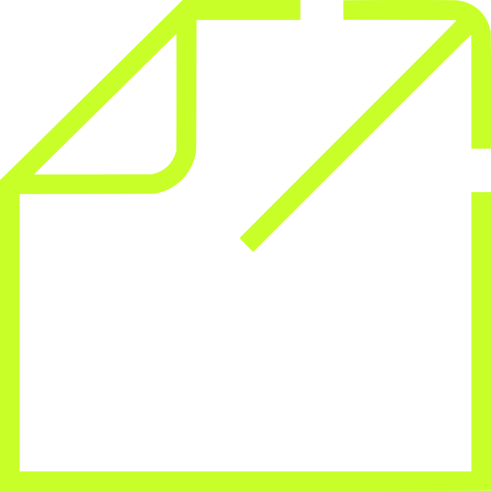

# AGCS | Studio + Lab -- Design System

> **>> Stay Forward.**

AGCS is a strategic thinking studio and innovation lab based in Mexico City. It serves C-suite audiences in LATAM with strategic frameworks, executive assessments, and AI-native workflows. Outputs are slide decks (4K 16:9), handbooks, system documentation, and prototypes.

The brand has **two functional arms** under **one visual identity**:
- **Studio** -- strategic frameworks, executive assessments, recommendations.
- **Lab** -- AI-native workflows, system architectures, prototypes.

The Lab is a *register*, not a sub-brand. It does not have its own color, type, or logo. It is signaled only by a small mono stamp at top-right (`>> LAB · v[version]`), visible construction grid lines behind diagrams, and slightly heavier use of monospace in headings.

---

## Source materials

These were provided by the client and underpin every decision in this system. Originals live in `uploads/`.

| File | What it is |
|---|---|
| `assets/agcs_mark_{white,black,lime}.svg` | **The AGCS mark.** Two columns on a uniform gutter, the right column split by the same gutter. Reconstructed from the Customer Journey deck -- replace with the master vector when available. |
| `assets/agcs_lab_icon_{lime,white,black}.svg`, `uploads/agcs_lab_icon.svg` | **NOT the mark.** All four files are the same document-and-arrow glyph, which is a *topic icon* -- the Workshop deck uses it as its cover subject. Kept for that use; never as a logo. |
| `uploads/Documento Sistema AGCS.pdf` | Internal infra doc -- references two product repos: `vicho-btw/agcs-dris-system` (DRIs system) and `vicho-btw/futurebydesign` (ARGUS). Hosted on Supabase + Render. Codebases were *not* attached to this project. |
| `uploads/Culture by Design - Executive Pre-Assessment V3.pdf` | A 19-page real Studio deliverable for **Cinépolis**. The canonical reference for layout, voice, and rhythm. Quotes Schein + Christensen on the closing pages. |

> **Caveat -- codebases not attached.** The DRIs system and ARGUS repos are referenced in the source doc but were not imported. This system therefore covers the **slide / handbook visual identity** comprehensively but does **not** include UI kits for those two products. If you want kits for them, re-attach the repos via the Import menu and I'll build them against the real components.

---

## Index -- what's in this folder

| Path | Purpose |
|---|---|
| `README.md` | This file. Read first. |
| `SKILL.md` | Skill manifest -- makes this folder usable as an Agent Skill. |
| `colors_and_type.css` | Single source of truth for color + type tokens. Import this anywhere. |
| `assets/` | Logos, icons, brand marks. Always copy from here -- never re-link to `uploads/`. |
| `assets/icons/` | The proprietary AGCS icon library -- four sets + construction grids. See *Iconography*. |
| `fonts/` | Local font files for **N27** (display, three weights + reserved variants in `_reserve/`) and **IBM Plex Mono** (body, Regular + Medium). See *Fonts* below. |
| `preview/` | Small HTML cards that populate the Design System tab. One concept per card. |
| `slides/` | The seven canonical slide layouts as 4K HTML files. |
| `uploads/` | Originals from the client -- do not edit, only copy out of. |

---

## CONTENT FUNDAMENTALS

### Voice -- declarative, conclusion-first

The headline **is** the insight, not the topic. AGCS does not hedge.

| Don't write | Write |
|---|---|
| "We believe culture is a system." | "Culture is a system." |
| "Topic: cultural alignment in scale-ups." | "Alignment kills innovation when it costs nothing." |
| "Some takeaways from the assessment..." | "Three patterns. One requires action this quarter." |

Numbers are evidence, not decoration. A slide with `69%` shown lime-bold should be answering *the* question on the slide above it -- never "look how much data we have."

**Paragraph length: 2-3 lines maximum.** From the Cinépolis deck, the synthesis paragraphs run 3 lines, each line ~80-100 mono characters. Never a fourth line. If it doesn't fit, the conclusion isn't sharp enough yet.

### Person, casing, language

- **Third-person observational** in body. "The organization is optimized for efficiency." Not "we found that you are optimized..." or "they are optimized...". The studio reports what is, with detachment.
- **Direct address only in CTAs and prompts** in assessments -- "¿Cuál de las siguientes afirmaciones representa mejor tu visión personal?" (tú, never usted).
- **Sentence case in body.** Never Title Case.
- **ALL CAPS** is allowed *only* in short mono labels: `INTRO`, `SYNTHESIS`, `>> LAB · V03`, `Q1`, `Q2`. Never on a headline.
- **Bilingual -- Spanish-primary, English second.** Most Studio work ships in Spanish; quotes from English thinkers (Schein, Christensen) are kept in original English and not translated.

### Signature copy patterns

These appear verbatim across Studio deliverables -- treat them as type fixtures, not suggestions.

- **Tagline**: `>> Stay Forward`
- **Brand attribution / footer**: `AGCS | Studio + Lab |` -- always with spaces around the `+`, and the trailing pipe is intentional.
- **Section openers**: a single word in mono caps, the chevron, then the section name in N27 Bold. E.g. `INTRO` / `>>  Culture By Design`.
- **Insight headlines (oversized)**: 2-4 words. From Cinépolis:
  - "No es un tema de comunicación"
  - "Sesgo fuerte a explotación y corto plazo"
  - "Falta de transparencia y fricción sana"
- **Closing quotes**: a full Crimson Pro italic quote, em-dash, name. No company, no role. The thinker stands alone.

### The chevron `>>`

The chevron is the brand mark in text form. It is **typed, not imaged**. Use it:
- Before a tagline (`>> Stay Forward`)
- Before a section name (`>>  Culture By Design`)
- As a small pointer on assessment options (`D. ... >>`)
- Inline as a separator in mono labels

Never decorative. Never repeated for emphasis (no `>>>>`). Never set in lime -- the icon already carries lime.

### Emoji & extra ornament -- **none**

No emoji. No unicode dingbats. No decorative rules. The chevron `>>` is the only repeating glyph.

---

## VISUAL FOUNDATIONS

### Color

Core five + the v3 functional palette. Anything else is off-brand.

| Token | Hex | Use |
|---|---|---|
| Obsidian | `#000000` | Covers, section dividers, quote slides. Body text on paper. |
| Paper | `#FFFFFF` | Content slide backgrounds. Body text on obsidian. |
| **Lime** | `#C8FF29` | The accent (v3, applied 2026-08-27; legacy v2 was `#BEFF3A`). Must equal the icon library: those are baked PNGs, regenerated to this value on 2026-08-27 so icons and lime fills match on the same slide. If this token ever changes again, the PNGs under `assets/icons` must be regenerated with it. **One point of focus per slide**: the topic icon, OR one chart bar, OR one table cell, OR one callout. The `.chip-lime` eyebrow is exempt -- it tags the slide rather than competing for the eye, so chip + one focus element is correct. Never background, never body text. |
| Carbon | `#1A1A1A` | Long-form body on paper (softer than Obsidian, lower fatigue). |
| Mist | `#E5E5E5` | Hairline dividers, band borders, journey-map cell borders. **Not** the construction grid. |
| Grid line | `#F2F2F2` | The construction grid only. Sits lighter than Mist on purpose: at 4px it must read as texture, not as a second layer of rules competing with the content. |

**v3 functional palette (brand ruling 2026-07-20)** -- role-bound, exact values, never decorative:

| Token | Hex | Role |
|---|---|---|
| Data | `#00A1F1` | Data visualization, system indicators, information layers |
| Warn | `#FFFF00` | Warnings, pending actions, attention-required states |
| Risk | `#ED1C24` | Risks, blockers, critical alerts, delays |

**Any other blue, green, amber, red, purple, or gradient of any kind remains off-brand.** Decorative blues still place AGCS in the McKinsey / BCG / Deloitte cluster the brand deliberately rejects -- the Data blue exists only as a bound functional value, never as a brand or decoration color.

### Typography  &mdash;  v3 (Titulo > N27 · Sub titulo > IBM Plex Sans · Texto > IBM Plex Mono)

| Role | Family | Weight | Where |
|---|---|---|---|
| Titulo / display | **N27** | Bold (700), Medium (500) | Slide titles, insight headlines, cover, section dividers |
| Sub titulo | **IBM Plex Sans** | Regular (400) &ndash; Bold (700) | Subtitles / subheads (v3 -- replaces N27 Medium in this role) |
| Texto / data / labels / footers / stamps | **IBM Plex Mono** | Regular (400) | Everywhere else -- this is the *technical signature* of the brand |
| Reflective line | **Crimson Pro** | Italic | The pull quote, and the one-line promise under a cover or sign-off title (`.deck-line`). One per slide. |

**N27** is the canonical AGCS display face as of v2. It replaces Archivo and Helvetica Neue everywhere they previously appeared. It loads **locally** via `@font-face` from `fonts/` -- as does IBM Plex Mono (v2 update). There is no CDN dependency: Crimson Pro Italic is local too; see *Fonts* below for the full picture.

- **CSS stack:** `"N27", system-ui, sans-serif` -- the explicit `system-ui` fallback keeps the design degrading to a host sans (San Francisco / Segoe / Roboto), never a serif, in environments where N27 hasn't been installed yet.
- **Status:** installed. `fonts/N27-Regular.otf`, `fonts/N27-Medium.otf`, `fonts/N27-Bold.otf` are on disk and wired into the @font-face block.
- **Weights in the system:** Regular (400), Medium (500), Bold (700). The full N27 family (Thin / ExtraLight / Light + matching Italics) is parked in `fonts/_reserve/` for reference but is NOT loaded. Confirm with Max before promoting any reserve weight.
- **License-pending state (legacy):** if the `.otf` files ever go missing or the system is shipped without them, the cover footer should declare the fallback. Canonical row: `FONTS — [FALLBACK] · IBM PLEX MONO · CRIMSON PRO // PENDING · N27 · LICENSE INTEGRATION`.

The deck is **monospace-dominant**. Mono is the default; sans is the exception used for impact.

**The Insight headline rule.** Insight slides are intentionally oversized -- set the N27 Bold headline so large that the descenders of one line touch the cap-height of the next. The line-height is `0.92`, not `1.1` or `1.2`. This is a deliberate brand voice device: the visual tension says *"this conclusion is too big to fit politely."* Do not "fix" it by shrinking the text. See `--lh-insight` in `colors_and_type.css` and the `.agcs-insight` class.

### Backgrounds

- No images. No textures. No gradients. No patterns. No grain.
- Backgrounds are flat fields of Obsidian or Paper.
- The construction grid (Mist lines, 80px step @ 4K) **defines the Lab register** and runs full-bleed on every `reg-lab` slide. It is absent from `reg-studio`. Line weight is `--grid-line-w: 4px`, **not** a 1px hairline: slides are always displayed scaled down from 3840, so a 1px line renders at 0.2-0.5px and vanishes.

### Layout

- Canvas is 4K 16:9 -- **3840 x 2160**.
- Edge padding: **160px** (4K). Header band internal padding: **120px**.
- Section divider band: ~30% canvas height. Content slide header band: ~22%.
- The cover icon (lime SVG) sits in the **right half** of the cover, optical-centered vertically. Always.
- The chevron `>>` is the only repeating motif.

### Animation, hover, press

This is a print/slide-first identity. Default to **no animation**. When motion is unavoidable (interactive prototypes, AI workflow demos):
- **Easing**: `cubic-bezier(0.2, 0, 0, 1)` -- sharp, exit-fast.
- **Duration**: 160ms for affordance changes, 240ms for layout shifts. Never longer.
- **No bounces, springs, or overshoots.** Linear deceleration only.
- **Fades**: opacity 0 -> 1 over 200ms. That's it. No blurs, no slides-in-from-direction.
- **Hover**: opacity drop to `0.7` *or* invert ground (Obsidian↔Paper). Never a tint shift, never a "darker version of the brand color."
- **Press**: no shrink, no shadow change. Invert the ground.

### Borders, shadows, radii

- **Border radius: 0.** Everything is square. The mark is built from plain rectangles on a shared gutter; the system follows it.
- **Shadows: 0.** No drop shadows, no inner shadows, no glow. Hierarchy comes from spacing and color, never from elevation.
- **Borders: 1px Mist hairlines only.** Never a 2px border. Never a colored border.
- No "card" container in the traditional sense -- content sits directly on Paper or Obsidian, separated by whitespace and mono rules.

### Transparency, blur, capsules

- **None.** No glass effects, no backdrop-blur, no protection gradients, no rounded capsules.
- If text needs to be on top of imagery, the imagery is wrong for the slide.

### Imagery vibe

- The deck contains **no photography** by default. When a client engagement requires images (e.g. a portrait of a quoted executive), images are **high-contrast black & white**, full-bleed on a Paper-background slide, with no overlay. No warm tones, no cool tones, no grain filters.
- Diagrams are line-based -- 1px Carbon on Paper, or 1px Mist on Obsidian. Lime can highlight **one** node per diagram.

### Fixed elements (every content slide)

- Top-left: section name in mono label caps (e.g. `INTRO`, `SYNTHESIS`, `Q3`).
- Top-right (Lab only): `>> LAB · V[version]` stamp.
- Bottom-left: `AGCS | Studio + Lab |` mono attribution.
- Bottom-right (optional): slide number in mono -- never with "of N".

---

## ICONOGRAPHY

### The mark

The AGCS mark is a three-rectangle construction: a full-height column on the left, and a right column split into a tall block and a short one. Both gutters are identical (20/600) -- that equality is the whole idea, so never adjust one without the other.

```
assets/agcs_mark_white.svg   -- on Obsidian
assets/agcs_mark_black.svg   -- on Paper
assets/agcs_mark_lime.svg    -- when the mark is the slide's one lime element
```

It appears **at size on the logo slide and nowhere else**. Covers do not carry the mark; they carry a topic icon (see *Iconography*).

> **Correction, and it matters:** earlier versions of this file called `agcs_lab_icon_*.svg` "the brand icon" and "the only logo". They are not. All four of those files hold the same document-and-arrow glyph, which is a **topic icon** from the library -- the Customer Journey Workshop deck uses it as its cover subject. The mark above was missing from this system entirely until it was measured back out of a deck.

The mark is **not a wordmark**. The textual brand mark is the chevron `>>` typed in mono, the attribution string `AGCS | Studio + Lab |`, and the full lockup `AGCS Strategic Design | Studio + Lab |` set in N27 on the logo slide.

### The AGCS icon library (`assets/icons/`) -- v3

The brand now ships its **own proprietary icon library**: hand-drawn line icons constructed on the brand grid, matching the geometry of the brand icon. This supersedes the earlier "no icons ever / Lucide as flagged substitution" rule: **third-party icon sets (Lucide, Heroicons, Material, SF Symbols) are now forbidden outright** -- if an icon is needed, it comes from this library or it doesn't exist yet.

| Path | Contents |
|---|---|
| `assets/icons/alxgdo/` | **The main set -- 34 line icons** (flask, eye, gear, binoculars, telescope, lightbulb, charts, checkboxes, arrows...). Colorway folders: `negro/`, `blanco/`, `verde1/` (**= Lime #C8FF29**, recolored from #BEFF3A on 2026-08-27), `verde2/` (#C0E234, legacy), `verde3/` (#88B04B, legacy). Files `01.png`-`34.png`, plus `animation.gif`. |
| `assets/icons/icons-grid/` | 16-icon subset drawn over the visible construction grid. `color-01/` + `color-02/` (lime variants), `color-03/` (white), `color-04/` (black). |
| `assets/icons/new-icons/` | 11 newer icons (brain, gauge, growth, kite/diamond, fast-forward, tools). Same 4 colorway folders. |
| `assets/icons/grid-templates/` | The 14 icon-construction grids + `principal.png`, in `black/` and `white/`. Reference material for drawing new icons -- not for use on slides. |
| `assets/icons/_source/ICONOS.pdf` | Source sheet for the construction grids. (The editable `ICONOS.ai` lives outside this project -- the platform rejects `.ai` uploads.) |

**Usage rules:**

- **Colorway follows ground:** `negro` on Paper, `blanco` on Obsidian. That is the default and covers ~all uses.
- **`verde1` is Lime.** A `verde1` icon **counts as the slide's single Lime element** -- it competes with the brand icon, the lime chart bar, and the lime callout. One of the four, never two.
- **`verde2` and `verde3` are legacy colorways** from the original delivery. They are *not* in the five-color palette -- keep them for archival fidelity, do **not** use them in new work.
- **Icons are evidence, not decoration.** The deck remains typographic-first. An icon earns its place the way a number does -- as signage for a concept. Never a row of icons as visual filler, never bullets-with-icons.
- **Format:** high-resolution PNG (2251px, transparent background). Render small (≤160px @ 4K canvas); never stretch beyond source size.
- Preview cards for all four sets live in the Design System tab under the **Icons** group.

### Emoji, unicode glyphs

**Never.** Not in slides, not in handbooks, not in product. The only repeating glyph allowed across the system is the chevron `>>` (two `>` characters).

---

## Fonts

| Role | Family | Weights | Source | Why this one |
|---|---|---|---|---|
| Display + heading | **N27** | Bold 700, Medium 500, (Regular 400 reserve) | **Local** -- `fonts/N27-*.otf` | Canonical AGCS display face. Replaces Archivo and Helvetica from v1. |
| Body, data, labels, stamps | **IBM Plex Mono** | Regular 400, Medium 500 | **Local** -- `fonts/IBMPlexMono-*.ttf` | The technical signature of the brand. Mono is the default, sans is the exception. v2: localized so the workhorse face has zero CDN dependency. |
| Reflective line | **Crimson Pro** | Italic 400 | **Local** -- `fonts/CrimsonPro-Italic.ttf` | Transitional serif with a refined italic. The quote layout plus the cover/sign-off deck line. |

All three families load through `@font-face` declarations at the top of `colors_and_type.css`. Each block uses `local()` lookups first (machines with the family installed system-wide skip the file lookup entirely), then falls back to the bundled file. **Zero CDN dependencies** -- the system runs fully air-gapped.

### Installing N27

Installed. The three system weights are on disk:

```
fonts/N27-Regular.otf     (weight 400 -- reserve)
fonts/N27-Medium.otf      (weight 500 -- subheads)
fonts/N27-Bold.otf        (weight 700 -- display, insight headlines, covers)
```

The full family (Thin / ExtraLight / Light + matching Italics) is parked in `fonts/_reserve/`. Those files are NOT loaded by `colors_and_type.css` -- they are kept on disk so any future promotion of a weight into the system is a one-line CSS change, not a re-licensing round-trip.

N27 is NOT served via CDN. Several client deployments (banking, government) sit behind networks that block `fonts.googleapis.com` and similar third-party font hosts -- local-only delivery is the contract.

### IBM Plex Mono (v2: localized)

```
fonts/IBMPlexMono-Regular.ttf   (weight 400 -- body, data, labels, stamps)
fonts/IBMPlexMono-Medium.ttf    (weight 500 -- emphasis runs, used sparingly)
```

v1 served Plex Mono from Google Fonts. v2 bundles it locally for the same reason as N27: the workhorse face cannot depend on a network host that bank-side firewalls routinely block. The family is SIL OFL-licensed -- bundling and redistributing is explicitly permitted.

### Crimson Pro (v2: localized)

```
fonts/CrimsonPro-Italic.ttf    (weight 400 italic -- quote slide layout only)
```

v1 served Crimson Pro from Google Fonts. v2 bundles it locally so the system has zero external dependencies. The family is SIL OFL-licensed -- bundling and redistribution is explicitly permitted. The other six Crimson Pro weights (Regular, Light, ExtraLight, Medium, SemiBold, Bold) ship in the Google Fonts download but aren't used by the system; they're parked in `fonts/_reserve/`.

### Fallback behavior

When `fonts/N27-*` files are missing, the `@font-face` `src` chain silently fails over to the next family in the stack: `system-ui, sans-serif`. The host OS sans (San Francisco / Segoe / Roboto) renders instead. Same applies to Plex Mono -- its stack falls through to `ui-monospace, SFMono-Regular, Menlo, Consolas, monospace`. The cover may declare this state -- see `slides/01-cover.html` for the canonical fallback row.

---

## Canonical slide layouts (7)

Sample HTML for each lives in `slides/`. Index at `slides/index.html`.

Every slide picks a **register** (`reg-studio` / `reg-lab`) and carries a **topic icon** on the right. See *Hard constraints* in `SKILL.md`.

1. **Cover** -- Obsidian. Lime chip eyebrow, N27 display title, Crimson italic deck line, mono metadata, oversized lime topic icon right.
2. **Section divider** -- Studio: Obsidian band (~30%). Lab: Paper, hairline, construction grid. Single mono section name.
3. **Content** -- Studio: Obsidian band (~22%). Lab: Paper, hairline, grid. Title + body + optional chart.
4. **Insight** -- Paper, oversized N27 Bold headline (descenders touch cap-height), short mono paragraph below.
5. **Quote** -- Obsidian, centered Crimson Pro italic quote, em-dash + name in mono below.
6. **End** -- Obsidian, block wordmark centered.
7. **System (Lab)** -- Paper, slim header, construction grid **full-bleed**, diagram nodes on solid Paper, `>> LAB · v[N]` stamp top-right.
8. **Journey map** -- Paper, no band. Title over a hairline, framing pair, then a 5-stage x 4-row table. Exactly one lime cell marks the moment that needs action.
9. **Next steps** -- Obsidian. Lime chip, N27 title, a row of outlined step cards separated by chevrons, Crimson italic line, oversized `>> Stay Forward` sign-off bottom right.
10. **Logo** -- Obsidian, the mark centered at size, `>> Stay Forward` below, centered lockup at the foot. The one centered layout in an otherwise left-aligned system.

---

## How to use this system

```html
<!-- Drop into any HTML head -->
<link rel="stylesheet" href="colors_and_type.css">
```

```html
<!-- A content slide title -->
<h1 class="agcs-h1">Culture is a system, not a message.</h1>

<!-- A mono label -->
<span class="agcs-label">SYNTHESIS</span>

<!-- The brand chevron, inline -->
<span class="agcs-chevron">&gt;&gt;</span> Stay Forward

<!-- The lime icon -->


<!-- A library icon: colorway follows ground -->


<!-- A quote slide -->
<blockquote class="agcs-quote">
  Culture is the processes by which people in an organization make decisions.
</blockquote>
```

For more, read `colors_and_type.css` top-to-bottom -- it is the source of truth.
