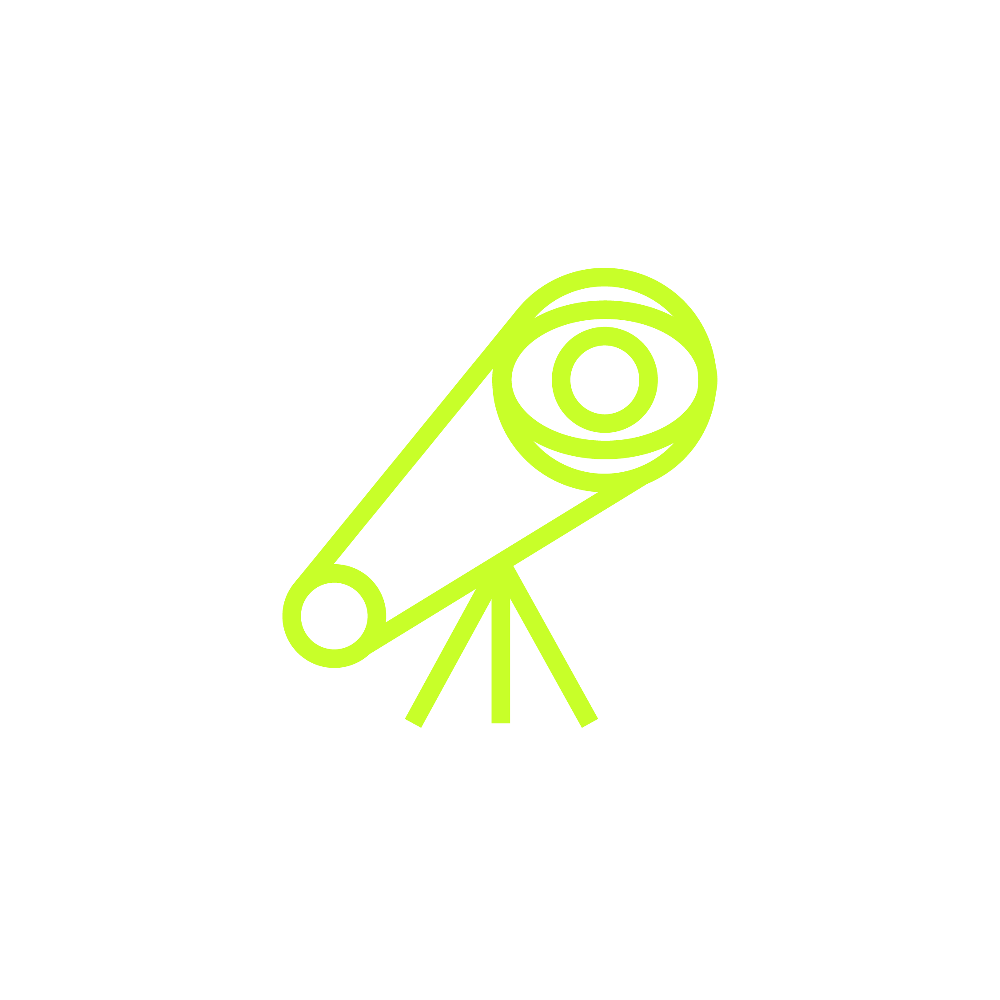
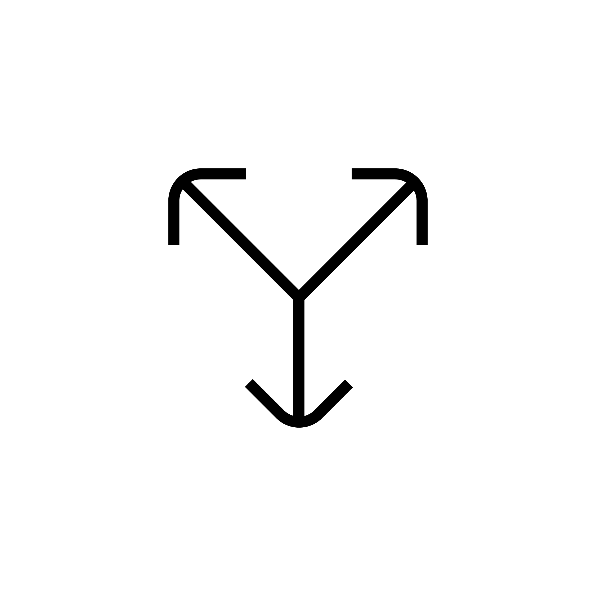

# AGCS · Decks y documentos

The AGCS | Studio + Lab brand design system: decks, handbooks and documents. In Claude Design: **AGCS · Decks y documentos**. Product apps use its sibling, [AGCS · Apps](https://github.com/AGCS-Studio-Lab/agcs-ui) (repo `agcs-ui`).

> **>> Stay Forward.**

AGCS is a strategic thinking studio and innovation lab based in Mexico City. It serves C-suite audiences in LATAM with strategic frameworks, executive assessments, and AI-native workflows. Outputs are slide decks (4K 16:9), handbooks, system documentation, and prototypes.

The brand has **two functional arms** under **one visual identity**:
- **Studio** -- strategic frameworks, executive assessments, recommendations.
- **Lab** -- AI-native workflows, system architectures, prototypes.

The Lab is a *register*, not a sub-brand. It does not have its own color, type, or logo. It is signaled by a small mono stamp at top-right (`>> LAB · v[version]`) and slightly heavier use of monospace in headings -- and by nothing else. Both registers follow the same grid rule: divider, plus chart / table / diagram slides.

> **v5.1 rulings (2026-09-02), from a second delivered-deck review:** the subtitle is **Crimson Pro SemiBold Italic 600** (the weight that actually ships in `/fonts`; v5 declared 700 over a 600 file and every subtitle came out lighter than the rule said); the grid is **40px step, 2px line, rgba** -- smaller cell, real transparency; the grid goes on the **divider and on chart / table / diagram slides only**, not "everything but the silence slides", which in a real deck meant every slide; **every slide carries exactly one lime element -- zero is a defect, not compliance**; there is **no header band**; **slides with a chart, table or diagram carry no topic icon**; and the **cover icon is chosen per deck** from `assets/icons/INDEX.md`, never the same one twice.

> **v5.2 rulings (2026-09-08), from what came back in downloaded deliverables:** the grid line goes to **3px at `rgba(0,0,0,.09)` / `rgba(255,255,255,.11)`** and every gradient is **written literally, never through `var()`**. Both changes are export defects, not preferences: the canvas is 3840 and is always seen scaled, so v5.1's 2px at 4.5% became a 0.67px line at ~3% alpha at 1280 and was simply absent; and the static renderer behind HTML-to-Express and PDF export declares that custom properties may not resolve, so a grid built from three nested `var()` exported as a blank ground. Fonts are the same class of defect: `@font-face` declared `local()` first and then a **relative** path to `/fonts`, so any renderer without N27 and Crimson Pro installed -- which is every export machine -- fell through to Georgia and **synthesised** the 600 italic, which is why subtitles stopped being Crimson Pro SemiBold Italic in downloaded files. **Nothing leaves this repo as authored HTML any more:** `tools/build-export.py` produces the self-contained file, with the CSS inlined, the fonts embedded as base64 with `local()` removed, the assets embedded, the scripts dropped and the `hz:` / `data-canvas-*` metadata written. See `writing.md` for the voice and report standard that governs what goes *inside* these layouts.

> **v5.6 (2026-09-25): the deck grid and the app grid share one format.** The step goes from 40px to **48px at 4K**: a 3840 slide is always seen scaled, and at 1280 it shrinks to a third, so 48px reads as 16px and the 3px line as 1px -- exactly the agcs-ui grid. 48 divides both canvas dimensions (80 × 45 cells). What had to land on a line moved with the step: the edge padding goes from 160px to **144px** (3 cells), the divider header region from 640px to **624px** (13 cells; the content one stays at 480px, 10 cells), chart bars in **whole 48px cells**, and the System diagram is redrawn on the cells. Line weight and transparency do not change (v5.2). `tools/fix-pptx.py` rebuilds the PowerPoint grid at 48px.
>
> **v5.5 (2026-09-24): product apps move to their own repo.** Everything a screen needs and a deck does not now lives in [AGCS-Studio-Lab/agcs-ui](https://github.com/AGCS-Studio-Lab/agcs-ui): the vendored `ui/` primitives, the UX rules, and the app tokens for color and grid. This repo keeps the brand and still governs it. agcs-ui adds three scoped exceptions, validated for apps and never used in a deck: seven series colors for charts that compare series, amber `#FFB800` in place of Warn `#FFFF00` (the Warn yellow and the Lime are almost indistinguishable, 6.9 in OKLab), and a red fill `#E31A22` behind white text. `ui/README.md` and `ux-rules.md` stay here as pointers.
>
> **v5.4 rulings (2026-09-22), from the Banco G&T decks downloaded on 2026-09-21:** **(1) The grid lives in the slide layout.** The PPTX converter delivers the CSS grid inconsistently -- as ~150 loose rectangles per slide, or as one slide-sized gradient rectangle with no grid in it (`Slide_deck_about_AGCS_system_MALO.pptx`), or as a raster -- and even the good case leaves 150 shapes that get selected and dragged on every edit. `tools/fix-pptx.py` now removes the grid from each slide in whatever form it arrived and rebuilds it once, as grouped native rectangles at the v5.2 values, in two layouts: `AGCS · Grid Paper` and `AGCS · Grid Obsidian`. In PowerPoint it is background: drawn under everything, not selectable, vector, and it travels with the slide. Verified by exporting the repaired MALO file from PowerPoint to PDF. **(2) A lab deck always opens with the lab icon, the flask `alxgdo/01`** (`assets/agcs_lab_icon_{lime,white,black}.png`), exempt from the rule against repeating cover icons. The old `agcs_lab_icon_*.svg` held the document-and-arrow glyph -- anyone asked for "the lab icon" found the wrong one by name -- and are renamed `agcs_doc_arrow_*.svg`. **(3) On the cover and the divider the icon's center sits on the title block's center**, not the canvas's. `.lockup-row` does it in layout (flex, no transform), with a gap that keeps the icon off the title. Before, the cover icon sat on the canvas center below a title that sits high, and a 1300px divider icon sat on the divider title.
>
> **v5.3 rulings (2026-09-14), from the two `.pptx` downloaded on 2026-09-13:** the PPTX route breaks the same two things for reasons the v5.2 fix does not reach, because the converter behind it (**PptxGenJS** -- it signs `docProps/app.xml`) does not rasterize and does not read the canvas background: it maps DOM elements to native PowerPoint shapes. **The grid does export** -- ~150 rectangles per slide, 40px step, verified in the XML -- but at the v5.1 values it is invisible: 2px with `<a:alpha val="4000">` on a slide that measures 3840px = **40 inches**, shown by PowerPoint at a third of that, is a 0.67px line at ~3% alpha. The v5.2 values (3px, 9% / 11%) are what make it survive; `var()` never enters this route. **The subtitle breaks on the font's own name.** PPTX has no weights -- only a bold boolean -- so a 600 subtitle exports as `typeface="Crimson Pro"` with `b="1" i="1"`, and the legacy RIBBI family "Crimson Pro" holds Regular, Italic and Bold but **no Bold Italic**: PowerPoint finds no face and synthesises a fake bold over the 400 italic. The file answers to two names at once (`CrimsonPro-SemiBoldItalic.ttf` is "Crimson Pro" + "SemiBold Italic" in the typographic names, **"Crimson Pro SemiBold" + "Italic" in the legacy ones**), and the legacy pair is the one PowerPoint searches. So the subtitle is now asked for **as family `"Crimson Pro SemiBold"` at weight 400** -- same face, no bold, nothing to synthesise. **Two consequences:** never raise that 400 back to 600, and `python3 tools/fix-pptx.py` repairs any `.pptx` that came out of a source still on the old values (today: Claude Design). And one thing neither fixes: **the PPTX embeds no fonts at all**, so on a machine without N27, Crimson Pro and Plex Mono installed everything substitutes regardless -- for external delivery the PDF is the honest format.

---

## Source materials

These were provided by the client and underpin every decision in this system. Originals live in `uploads/`.

| File | What it is |
|---|---|
| `assets/agcs_mark_{white,black,lime}.svg` | **The AGCS mark.** Two columns on a uniform gutter, the right column split by the same gutter. Reconstructed from the Customer Journey deck -- replace with the master vector when available. |
| `assets/agcs_lab_icon_{lime,white,black}.png` | **The lab icon** -- the flask, `alxgdo/01`. The cover of every lab deck (v5.4). |
| `assets/agcs_doc_arrow_{lime,white,black}.svg`, `uploads/agcs_lab_icon.svg` | **NOT the mark, NOT the lab icon.** The document-and-arrow glyph (`icons-grid/08`), a *topic icon*. Named `agcs_lab_icon_*.svg` until v5.4; renamed because the name sent every "lab icon" request to it. |
| `uploads/Documento Sistema AGCS.pdf` | Internal infra doc -- references two product repos: `vicho-btw/agcs-dris-system` (DRIs system) and `vicho-btw/futurebydesign` (ARGUS). Hosted on Supabase + Render. Codebases were *not* attached to this project. |
| `uploads/Culture by Design - Executive Pre-Assessment V3.pdf` | A 19-page real Studio deliverable for **Cinépolis**. The canonical reference for layout, voice, and rhythm. Quotes Schein + Christensen on the closing pages. |

> **Caveat -- codebases not attached.** The DRIs system and ARGUS repos are referenced in the source doc but were not imported. This system therefore covers the **slide / handbook visual identity**. The UI layer for the product apps lives in [AGCS-Studio-Lab/agcs-ui](https://github.com/AGCS-Studio-Lab/agcs-ui) since v5.5.

---

## Index -- what's in this folder

| Path | Purpose |
|---|---|
| `README.md` | This file. Read first. |
| `SKILL.md` | Skill manifest -- makes this folder usable as an Agent Skill. |
| `colors_and_type.css` | Single source of truth for color + type tokens. Import this anywhere. |
| `assets/` | Logos, icons, brand marks. Always copy from here -- never re-link to `uploads/`. |
| `assets/icons/` | The proprietary AGCS icon library -- four sets + construction grids. See *Iconography*. |
| `assets/icons/INDEX.md` | The icon catalogue: every icon by number, what it depicts, what it can argue. Pick cover and slide icons from here. |
| `fonts/` | Local font files for **N27** (display, three weights + reserved variants in `_reserve/`) and **IBM Plex Mono** (body, Regular + Medium). See *Fonts* below. |
| `preview/` | Small HTML cards that populate the Design System tab. One concept per card. |
| `slides/` | The seven canonical slide layouts as 4K HTML files. |
| `tools/build-export.py` | Builds the self-contained export HTML. Nothing leaves this repo as authored HTML. |
| `tools/fix-pptx.py` | Mandatory on every `.pptx`: moves the grid off the slides into a native grid layout, whatever form it arrived in, and fixes the subtitle face. See the v5.3 and v5.4 rulings. |
| `uploads/` | Originals from the client -- do not edit, only copy out of. |
| `ui/README.md`, `ux-rules.md` | Pointers. The product-UI layer moved to [agcs-ui](https://github.com/AGCS-Studio-Lab/agcs-ui) in v5.5. |

---

## CONTENT FUNDAMENTALS

### Voice -- declarative, conclusion-first

The headline **is** the insight, not the topic. AGCS does not hedge.

| Don't write | Write |
|---|---|
| "We believe culture is a system." | "Culture is a system." |
| "Topic: cultural alignment in scale-ups." | "Alignment kills innovation when it costs nothing." |
| "Some takeaways from the assessment..." | "Three patterns. One requires action this quarter." |

Numbers are evidence, not decoration. A slide with `69%` shown lime-bold should be answering *the* question on the slide above it -- never "look how much data we have."

**Paragraph length: 2-3 lines maximum.** From the Cinépolis deck, the synthesis paragraphs run 3 lines, each line ~80-100 mono characters. Never a fourth line. If it doesn't fit, the conclusion isn't sharp enough yet.

### Person, casing, language

- **Third-person observational** in body. "The organization is optimized for efficiency." Not "we found that you are optimized..." or "they are optimized...". The studio reports what is, with detachment.
- **Direct address only in CTAs and prompts** in assessments -- "¿Cuál de las siguientes afirmaciones representa mejor tu visión personal?" (tú, never usted).
- **Sentence case in body.** Never Title Case.
- **ALL CAPS** is allowed *only* in short mono labels: `INTRO`, `SYNTHESIS`, `>> LAB · V03`, `Q1`, `Q2`. Never on a headline.
- **Bilingual -- Spanish-primary, English second.** Most Studio work ships in Spanish; quotes from English thinkers (Schein, Christensen) are kept in original English and not translated.

### Signature copy patterns

These appear verbatim across Studio deliverables -- treat them as type fixtures, not suggestions.

- **Tagline**: `>> Stay Forward`
- **Brand attribution / footer**: `AGCS | Studio + Lab |` -- always with spaces around the `+`, and the trailing pipe is intentional.
- **Section openers**: a single word in mono caps, the chevron, then the section name in N27 Bold. E.g. `INTRO` / `>>  Culture By Design`.
- **Insight headlines (oversized)**: 2-4 words. From Cinépolis:
  - "No es un tema de comunicación"
  - "Sesgo fuerte a explotación y corto plazo"
  - "Falta de transparencia y fricción sana"
- **Closing quotes**: a full Crimson Pro italic quote, em-dash, name. No company, no role. The thinker stands alone.

### The chevron `>>`

The chevron is the brand mark in text form. It is **typed, not imaged**. Use it:
- Before a tagline (`>> Stay Forward`)
- Before a section name (`>>  Culture By Design`)
- As a small pointer on assessment options (`D. ... >>`)
- Inline as a separator in mono labels

Never decorative. Never repeated for emphasis (no `>>>>`). Never set in lime -- the icon already carries lime.

### Emoji & extra ornament -- **none**

No emoji. No unicode dingbats. No decorative rules. The chevron `>>` is the only repeating glyph.

---

## VISUAL FOUNDATIONS

### Color

Core five + the v3 functional palette. Anything else is off-brand in decks and documents; product apps add the scoped exceptions listed in agcs-ui (v5.5).

| Token | Hex | Use |
|---|---|---|
| Obsidian | `#000000` | Covers, section dividers, quote slides. Body text on paper. |
| Paper | `#FFFFFF` | Content slide backgrounds. Body text on obsidian. |
| **Lime** | `#C8FF29` | The accent (v3, applied 2026-08-27; legacy v2 was `#BEFF3A`). Must equal the icon library: those are baked PNGs, regenerated to this value on 2026-08-27 so icons and lime fills match on the same slide. If this token ever changes again, the PNGs under `assets/icons` must be regenerated with it. **One point of focus per slide**: the topic icon, OR one chart bar, OR one table cell, OR one callout. The `.chip-lime` eyebrow is exempt -- it tags the slide rather than competing for the eye, so chip + one focus element is correct. Never background, never body text. |
| Carbon | `#1A1A1A` | Long-form body on paper (softer than Obsidian, lower fatigue). |
| Mist | `#E5E5E5` | Hairline dividers, band borders, journey-map cell borders. **Not** the construction grid. |
| Grid line | `rgba(0,0,0,.09)` on Paper, `rgba(255,255,255,.11)` on Obsidian (v5.2) | The construction grid only. Alpha, not a light hex: an opaque `#F2F2F2` is nearly invisible on Paper yet hard on Obsidian, so the same token read differently on each ground. At a 48px step (v5.6) and a 3px line it must read as texture, never as a second layer of rules competing with the content. v5.1 set 2px at 4.5% and claimed it survived the reduction from 3840 to the screen; it did not -- at 1280 that is a 0.67px line the browser fades to about 3% alpha, which is why the grid was missing from every downloaded deck. |

**v3 functional palette (brand ruling 2026-07-20)** -- role-bound, exact values, never decorative:

| Token | Hex | Role |
|---|---|---|
| Data | `#00A1F1` | Data visualization, system indicators, information layers |
| Warn | `#FFFF00` | Warnings, pending actions, attention-required states. In product apps, amber `#FFB800` (agcs-ui, v5.5). |
| Risk | `#ED1C24` | Risks, blockers, critical alerts, delays |

**Any other blue, green, amber, red, purple, or gradient of any kind remains off-brand** in decks and documents. Product apps are the one scoped exception: the series palette, the amber and the red fill defined and tested in agcs-ui, used only in apps. Decorative blues still place AGCS in the McKinsey / BCG / Deloitte cluster the brand deliberately rejects -- the Data blue exists only as a bound functional value, never as a brand or decoration color.

### Typography  &mdash;  v5 (Titulo > N27 · Sub titulo > Crimson Pro SemiBold Italic · Texto > IBM Plex Mono)

| Role | Family | Weight | Where |
|---|---|---|---|
| Titulo / display | **N27** | Bold (700), Medium (500) | Slide titles, insight headlines, cover, section dividers |
| **Sub titulo** | **Crimson Pro SemiBold** (`font-weight: 400`, italic -- see v5.3 above) | **SemiBold Italic** | Every subtitle: the deck line under a cover or sign-off title (`.deck-line`), the one-line conclusion under a divider or content title (`.subtitle`, `.agcs-h2`). v5 -- replaces IBM Plex Sans (v3), which is retired. |
| Texto / data / labels / footers / stamps | **IBM Plex Mono** | Regular (400) | Everywhere else -- this is the *technical signature* of the brand |
| Pull quote | **Crimson Pro** | Italic (400) | The quote layout only. The only place the Regular italic appears. |

The title names the piece in N27. The subtitle states the conclusion in a bold serif italic. That contrast -- geometric sans against bold italic serif -- is the system's signature pairing; a sans or mono subtitle flattens it, which is why Plex Sans was retired.

**N27** is the canonical AGCS display face as of v2. It replaces Archivo and Helvetica Neue everywhere they previously appeared. It loads **locally** via `@font-face` from `fonts/` -- as does IBM Plex Mono (v2 update). There is no CDN dependency: Crimson Pro Italic is local too; see *Fonts* below for the full picture.

- **CSS stack:** `"N27", system-ui, sans-serif` -- the explicit `system-ui` fallback keeps the design degrading to a host sans (San Francisco / Segoe / Roboto), never a serif, in environments where N27 hasn't been installed yet.
- **Status:** installed. `fonts/N27-Regular.otf`, `fonts/N27-Medium.otf`, `fonts/N27-Bold.otf` are on disk and wired into the @font-face block.
- **Weights in the system:** Regular (400), Medium (500), Bold (700). The full N27 family (Thin / ExtraLight / Light + matching Italics) is parked in `fonts/_reserve/` for reference but is NOT loaded. Confirm with Max before promoting any reserve weight.
- **License-pending state (legacy):** if the `.otf` files ever go missing or the system is shipped without them, the cover footer should declare the fallback. Canonical row: `FONTS — [FALLBACK] · IBM PLEX MONO · CRIMSON PRO // PENDING · N27 · LICENSE INTEGRATION`.

The deck is **monospace-dominant**. Mono is the default; sans is the exception used for impact.

**The Insight headline rule.** Insight slides are intentionally oversized -- set the N27 Bold headline so large that the descenders of one line touch the cap-height of the next. The line-height is `0.92`, not `1.1` or `1.2`. This is a deliberate brand voice device: the visual tension says *"this conclusion is too big to fit politely."* Do not "fix" it by shrinking the text. See `--lh-insight` in `colors_and_type.css` and the `.agcs-insight` class.

### Backgrounds

- No images. No textures. No gradients. No patterns. No grain.
- Backgrounds are flat fields of Obsidian or Paper.
- **The construction grid is an accent, not a wallpaper** (v5.1, weights corrected in v5.2, step in v5.6): 48px step @ 4K -- 16px when a slide is seen at 1280, the same grid as agcs-ui -- full-bleed, `rgba(0,0,0,.09)` on Paper and `rgba(255,255,255,.11)` on Obsidian. **With grid** (`has-grid`): the Divider, and any slide carrying a chart, table or diagram -- Content *with a chart*, System, Build, Next steps. **The journey matrix is exempt** even though it is a table: it is already a grid of its own, and a construction grid behind it is a second grid that will not align (see `journey-lab/`). **Flat, by rule:** the five silence slides (Cover, Insight, Quote, End, Logo) **and text-only Content**, which is the bulk of a real deck. The register no longer changes this: `reg-lab` used to force the grid onto every Lab slide and no longer does. v5.0 said "every layout but the five silence slides", which in a deck made mostly of content slides means every slide -- and that is exactly what came back from Claude Design. What makes the grid honest instead of decorative is that things land on its lines: header hairlines at 624px / 480px (grid lines), left edges at the 144px edge padding (3 cells), chart baselines on a grid line with bar heights in whole 48px cells, dense tables on a solid Paper panel whose top edge is on a grid line, boxes with a solid ground fill. Line weight is `--grid-line-w: 3px` and the color is **rgba, not a light hex**: an opaque `#F2F2F2` is nearly invisible on Paper yet hard on Obsidian, and a thin line vanishes entirely when 3840 is scaled to the screen -- which is exactly what happened to the 2px/4.5% pair of v5.1. **The gradients are written literally at every point of use, never through `var()`:** the static renderer behind HTML-to-Express and PDF export declares that custom properties may not resolve, and the grid used to hang off three nested ones. Never set an inline `background:` on the canvas.

### Layout

- Canvas is 4K 16:9 -- **3840 x 2160**.
- Edge padding: **144px** (4K) -- three cells of the 48px grid (v5.6; was 160px). Header region internal padding: **120px**.
- Header region (title above a 1px Mist hairline): 624px on dividers, 480px on content slides, both grid lines (~29% / ~22% of the canvas; 13 and 10 cells). **It is never filled.** The Obsidian header band documented in v2-v4 does not appear in any delivered AGCS deck and was removed in v5.
- The cover icon (a `verde1` library icon, chosen for the deck) sits in the **right half** of the cover, optical-centered vertically. Always.
- The chevron `>>` is the only repeating motif.

### Animation, hover, press

This is a print/slide-first identity. Default to **no animation**. When motion is unavoidable (interactive prototypes, AI workflow demos):
- **Easing**: `cubic-bezier(0.2, 0, 0, 1)` -- sharp, exit-fast.
- **Duration**: 160ms for affordance changes, 240ms for layout shifts. Never longer.
- **No bounces, springs, or overshoots.** Linear deceleration only.
- **Fades**: opacity 0 -> 1 over 200ms. That's it. No blurs, no slides-in-from-direction.
- **Hover**: opacity drop to `0.7` *or* invert ground (Obsidian↔Paper). Never a tint shift, never a "darker version of the brand color."
- **Press**: no shrink, no shadow change. Invert the ground.

### Borders, shadows, radii

- **Border radius: 0.** Everything is square. The mark is built from plain rectangles on a shared gutter; the system follows it.
- **Shadows: 0.** No drop shadows, no inner shadows, no glow. Hierarchy comes from spacing and color, never from elevation.
- **Borders: 1px Mist hairlines only.** Never a 2px border. Never a colored border.
- No "card" container in the traditional sense -- content sits directly on Paper or Obsidian, separated by whitespace and mono rules.

### Transparency, blur, capsules

- **None.** No glass effects, no backdrop-blur, no protection gradients, no rounded capsules.
- If text needs to be on top of imagery, the imagery is wrong for the slide.

### Imagery vibe

- The deck contains **no photography** by default. When a client engagement requires images (e.g. a portrait of a quoted executive), images are **high-contrast black & white**, full-bleed on a Paper-background slide, with no overlay. No warm tones, no cool tones, no grain filters.
- Diagrams are line-based -- 1px Carbon on Paper, or 1px Mist on Obsidian. Lime can highlight **one** node per diagram.

### Fixed elements (every content slide)

- Ground: Paper with the construction grid. No band.
- Top-left: section name in mono label caps (e.g. `INTRO`, `SYNTHESIS`, `Q3`).
- Top-right: page number (Studio) or `>> LAB · V[version]` stamp (Lab).
- Bottom-left: `AGCS | Studio + Lab |` mono attribution.
- Bottom-right (optional): slide number in mono -- never with "of N".

---

## ICONOGRAPHY

### The mark

The AGCS mark is a three-rectangle construction: a full-height column on the left, and a right column split into a tall block and a short one. Both gutters are identical (20/600) -- that equality is the whole idea, so never adjust one without the other.

```
assets/agcs_mark_white.svg   -- on Obsidian
assets/agcs_mark_black.svg   -- on Paper
```

**The mark is only ever white or black.** White on Obsidian, black on Paper. Never lime, never on a lime ground, never on any other color (Max, 2026-09-02). The lime version that shipped in earlier versions was removed.

It appears **at size on the logo slide and nowhere else**. Covers do not carry the mark; they carry a topic icon (see *Iconography*).

> **Correction, and it matters:** earlier versions of this file called `agcs_lab_icon_*.svg` (now `agcs_doc_arrow_*.svg`) "the brand icon" and "the only logo". They are not. All four of those files hold the same document-and-arrow glyph, which is a **topic icon** from the library -- the Customer Journey Workshop deck uses it as its cover subject. The mark above was missing from this system entirely until it was measured back out of a deck.

The mark is **not a wordmark**. The textual brand mark is the chevron `>>` typed in mono, the attribution string `AGCS | Studio + Lab |`, and the full lockup `AGCS Strategic Design | Studio + Lab |` set in N27 on the logo slide.

### The AGCS icon library (`assets/icons/`) -- v3

The brand now ships its **own proprietary icon library**: hand-drawn line icons constructed on the brand grid, matching the geometry of the brand icon. This supersedes the earlier "no icons ever / Lucide as flagged substitution" rule: **third-party icon sets (Lucide, Heroicons, Material, SF Symbols) are forbidden in decks and documents** -- if an icon is needed there, it comes from this library or it doesn't exist yet. Product apps need functional icons the library does not draw (close, filter, search, navigation); there, per Max's ruling of 2026-09-09, Lucide at 1.5px in ink covers what has no library equivalent, and the library keeps the concepts. The rule lives in agcs-ui.

| Path | Contents |
|---|---|
| `assets/icons/alxgdo/` | **The main set -- 34 line icons** (flask, eye, gear, binoculars, telescope, lightbulb, charts, checkboxes, arrows...). Colorway folders: `negro/`, `blanco/`, `verde1/` (**= Lime #C8FF29**, recolored from #BEFF3A on 2026-08-27), `verde2/` (#C0E234, legacy), `verde3/` (#88B04B, legacy). Files `01.png`-`34.png`, plus `animation.gif`. |
| `assets/icons/icons-grid/` | 16-icon subset drawn over the visible construction grid. `color-01/` + `color-02/` (lime variants), `color-03/` (white), `color-04/` (black). |
| `assets/icons/new-icons/` | 11 newer icons (brain, gauge, growth, kite/diamond, fast-forward, tools). Same 4 colorway folders. |
| `assets/icons/grid-templates/` | The 14 icon-construction grids + `principal.png`, in `black/` and `white/`. Reference material for drawing new icons -- not for use on slides. |
| `assets/icons/_source/ICONOS.pdf` | Source sheet for the construction grids. (The editable `ICONOS.ai` lives outside this project -- the platform rejects `.ai` uploads.) |

**Usage rules:**

- **Pick from the catalogue.** `assets/icons/INDEX.md` lists all 61 icons by number with their subject and the arguments they can stand for. Every icon on a slide is chosen there, by meaning.
- **The cover icon is chosen per deck and never repeats.** It is the deck's subject. Journey → eye-with-arrow (`alxgdo/19`); culture → spiral (`22`); foresight → telescope (`18`); lab program → flask (`01`); decision → fork (`17`); growth → curve (`07`) or sprout (`new-icons/04`). There is **no house cover icon** -- neither `alxgdo/12` nor the document-and-arrow glyph. Two consecutive decks with the same cover icon is a defect.
- **No repeats inside a deck.** Cover, dividers and content slides each carry a different icon; rotate through the three sets.
- **Colorway follows ground:** `negro` on Paper, `blanco` on Obsidian. That is the default and covers ~all uses.
- **`verde1` is Lime.** A `verde1` icon **counts as the slide's single Lime element** -- it competes with the brand icon, the lime chart bar, and the lime callout. One of the four, never two.
- **`verde2` and `verde3` are legacy colorways** from the original delivery. They are *not* in the five-color palette -- keep them for archival fidelity, do **not** use them in new work.
- **Icons are evidence, not decoration.** The deck remains typographic-first. An icon earns its place the way a number does -- as signage for a concept. Never a row of icons as visual filler, never bullets-with-icons.
- **No icon next to data.** A slide with a chart, table or diagram carries no topic icon: the data is the visual. The icon slot belongs to cover, dividers, text-only content, insight and next steps.
- **Format:** high-resolution PNG (2251px, transparent background). Render small (≤160px @ 4K canvas); never stretch beyond source size.
- Preview cards for all four sets live in the Design System tab under the **Icons** group.

### Emoji, unicode glyphs

**Never.** Not in slides, not in handbooks, not in product. The only repeating glyph allowed across the system is the chevron `>>` (two `>` characters).

---

## Fonts

| Role | Family | Weights | Source | Why this one |
|---|---|---|---|---|
| Display + heading | **N27** | Bold 700, Medium 500, (Regular 400 reserve) | **Local** -- `fonts/N27-*.otf` | Canonical AGCS display face. Replaces Archivo and Helvetica from v1. |
| Body, data, labels, stamps | **IBM Plex Mono** | Regular 400, Medium 500 | **Local** -- `fonts/IBMPlexMono-*.ttf` | The technical signature of the brand. Mono is the default, sans is the exception. v2: localized so the workhorse face has zero CDN dependency. |
| Subtitle | **Crimson Pro** | SemiBold Italic 600 | **Local** -- `fonts/CrimsonPro-SemiBoldItalic.ttf` | The subtitle under every title, the deck line, the divider conclusion. |
| Pull quote | **Crimson Pro** | Italic 400 | **Local** -- `fonts/CrimsonPro-Italic.ttf` | Transitional serif with a refined italic. The quote layout only. |

All three families load through `@font-face` declarations at the top of `colors_and_type.css`. Each block uses `local()` lookups first (machines with the family installed system-wide skip the file lookup entirely), then falls back to the bundled file. **Zero CDN dependencies** -- the system runs fully air-gapped.

### Installing N27

Installed. The three system weights are on disk:

```
fonts/N27-Regular.otf     (weight 400 -- reserve)
fonts/N27-Medium.otf      (weight 500 -- subheads)
fonts/N27-Bold.otf        (weight 700 -- display, insight headlines, covers)
```

The full family (Thin / ExtraLight / Light + matching Italics) is parked in `fonts/_reserve/`. Those files are NOT loaded by `colors_and_type.css` -- they are kept on disk so any future promotion of a weight into the system is a one-line CSS change, not a re-licensing round-trip.

N27 is NOT served via CDN. Several client deployments (banking, government) sit behind networks that block `fonts.googleapis.com` and similar third-party font hosts -- local-only delivery is the contract.

### IBM Plex Mono (v2: localized)

```
fonts/IBMPlexMono-Regular.ttf   (weight 400 -- body, data, labels, stamps)
fonts/IBMPlexMono-Medium.ttf    (weight 500 -- emphasis runs, used sparingly)
```

v1 served Plex Mono from Google Fonts. v2 bundles it locally for the same reason as N27: the workhorse face cannot depend on a network host that bank-side firewalls routinely block. The family is SIL OFL-licensed -- bundling and redistributing is explicitly permitted.

### Crimson Pro (v2: localized · v5: the italic promoted to the subtitle)

```
fonts/CrimsonPro-SemiBoldItalic.ttf  (THE SUBTITLE -- declared twice, see below)
fonts/CrimsonPro-Italic.ttf          (weight 400 italic -- pull quote only)
```

One file, two `@font-face` blocks, because the file has two names and both are
its own. In the typographic names (nameID 16/17) it is **"Crimson Pro" +
"SemiBold Italic"**; in the legacy RIBBI names (nameID 1/2) -- the four-style
pairing inherited from the eighties -- it is family **"Crimson Pro SemiBold"**
+ style **"Italic"**. The first block declares the typographic pair at weight
600 and documents the file. The second declares the legacy pair at weight 400,
and **that is the one the system uses**: `--font-subtitle` puts
`"Crimson Pro SemiBold"` first in the stack and `.agcs-h2` / `.subtitle` /
`.deck-line` set `font-weight: 400`. PowerPoint searches by the legacy name
and PPTX has no weights, so a 600 subtitle exports as `"Crimson Pro"` with
bold on, into a family that has no Bold Italic -- and comes back as a
synthetic bold over the 400 italic. Asked for by the legacy name at 400, the
right face resolves everywhere and nothing is synthesised. The 400 is not a
lie about the weight: it is the Regular member of a family already called
SemiBold. **Do not raise it back to 600.**

v1 served Crimson Pro from Google Fonts. v2 bundles it locally so the system has zero external dependencies. v5 promoted the italic to the subtitle role, at **SemiBold Italic** -- the one semibold italic that is actually on disk. v5.0 briefly declared that face as `font-weight: 700` while serving the 600 file: the browser took the declaration at its word, applied no synthetic bolding, and every subtitle in every generated deck came out lighter than the rule claimed. A face that lies about its weight breaks the system in silence, so the declaration now matches the file. There is no `CrimsonPro-BoldItalic.ttf` in `fonts/` and the subtitle does not need one: v5.3 stopped routing the subtitle through bold at all. If a real Bold Italic ever enters the system it comes in as its own face under its own legacy name, and the subtitle stays where it is. The family is SIL OFL-licensed -- bundling and redistribution is explicitly permitted. The upright weights (Regular, Light, ExtraLight, Medium, SemiBold, Bold) aren't used by the system; they're parked in `fonts/_reserve/`. **IBM Plex Sans** is no longer loaded: its subtitle role ended with v5, the files stay in `fonts/` for archival fidelity only.

### Fallback behavior

When `fonts/N27-*` files are missing, the `@font-face` `src` chain silently fails over to the next family in the stack: `system-ui, sans-serif`. The host OS sans (San Francisco / Segoe / Roboto) renders instead. Same applies to Plex Mono -- its stack falls through to `ui-monospace, SFMono-Regular, Menlo, Consolas, monospace`. The cover may declare this state -- see `slides/01-cover.html` for the canonical fallback row.

---

## Canonical slide layouts (7)

Sample HTML for each lives in `slides/`. Index at `slides/index.html`.

Every slide picks a **register** (`reg-studio` / `reg-lab`). Slides without a data visual carry a **topic icon** on the right; slides with a chart, table or diagram do not. See *Hard constraints* in `SKILL.md`.

The construction grid goes on the divider and on slides carrying a chart, table or diagram -- and nowhere else. Text-only content and the five silence slides (Cover, Insight, Quote, End, Logo) are flat, in both registers. **The journey matrix is the one documented exception:** it is already a grid, so a construction grid behind it is a second grid, and two grids that do not align read as sloppy (see `journey-lab/`). The topic icon goes only on slides without a chart, table or diagram.

1. **Cover** -- Obsidian, flat. Lime chip eyebrow, N27 display title, **Crimson Pro SemiBold Italic** deck line, mono metadata, oversized lime topic icon right **chosen for this deck**.
2. **Section divider** -- Paper + grid. Hairline on a grid line under the header region (no band, either register). N27 section title, Crimson SemiBold Italic one-line conclusion.
3. **Content** -- Paper, hairline under the header region (no band). Title + body + optional chart. **With a chart:** the slide takes the grid and the chart snaps to it -- baseline on a grid line, bar heights in whole 48px cells (v5.6) -- and carries **no topic icon**, because the chart is the visual and the lime bar is the slide's lime. **Text-only:** flat, no grid, and it keeps the topic icon, which is where its lime lives.
4. **Insight** -- Paper, flat. Oversized N27 Bold headline (descenders touch cap-height), short mono paragraph below.
5. **Quote** -- Obsidian, flat. Centered Crimson Pro Italic 400 quote, em-dash + name in mono below.
6. **End** -- Obsidian, flat. Block wordmark centered.
7. **System** -- Paper + grid, slim header, diagram nodes on solid Paper. In Lab with the `>> LAB · v[N]` stamp; in Studio the same with a page number.
8. *(retired -- the journey map now lives in `journey-lab/`, as seven compositions rather than one slide. The old `slides/08-journey-map.html` carried a client's real session data and a composition that had been superseded, so it was removed rather than kept as a second answer to the same question. The numbering is left with a gap on purpose: 09 and 10 keep their names everywhere they are referenced.)*
9. **Next steps** -- Obsidian + grid. Lime chip, N27 title, a row of solid-fill outlined step cards separated by chevrons, Crimson SemiBold Italic line, oversized `>> Stay Forward` sign-off bottom right.
10. **Logo** -- Obsidian, the mark centered at size, `>> Stay Forward` below, centered lockup at the foot. The one centered layout in an otherwise left-aligned system.

---

## How to use this system

```html
<!-- Drop into any HTML head -->
<link rel="stylesheet" href="colors_and_type.css">
```

```html
<!-- A content slide title -->
<h1 class="agcs-h1">Culture is a system, not a message.</h1>

<!-- A mono label -->
<span class="agcs-label">SYNTHESIS</span>

<!-- The brand chevron, inline -->
<span class="agcs-chevron">&gt;&gt;</span> Stay Forward

<!-- A subtitle -->
<p class="agcs-subtitle">Growth can no longer come from store openings</p>

<!-- The cover icon: a verde1 library icon chosen for the deck (see assets/icons/INDEX.md) -->


<!-- A library icon: colorway follows ground -->


<!-- A quote slide -->
<blockquote class="agcs-quote">
  Culture is the processes by which people in an organization make decisions.
</blockquote>
```

For more, read `colors_and_type.css` top-to-bottom -- it is the source of truth.
